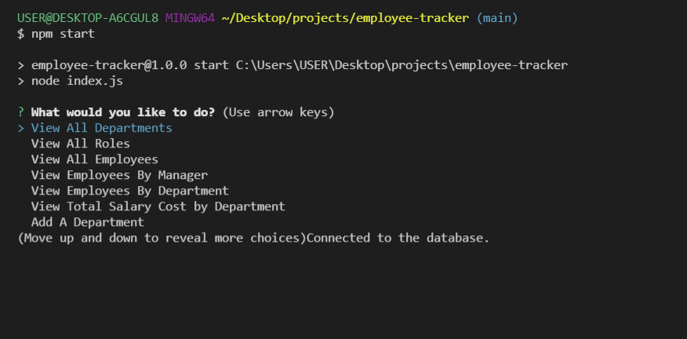
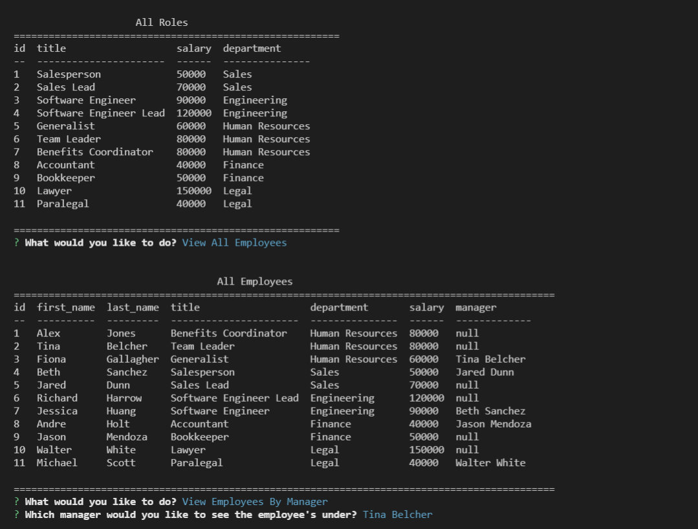

# Employee Tracker
The employee tracker is a node-based application that allows you to create and manipulate a database for employees in a company.

 

  ## Description
  Back End SQL based app what allows to create and manipulate a databse ofemployees.
  
  ## Link to the walkthrough video: https://youtu.be/t2Mzl_Pmsnc

## Table of contents
* [Installation](#installation)
* [Usage](#usage)
* [Credits](#credits)
* [License](#licence)
  

  ## Installation
  
  To install all the files for the "Employee Tracker" app please clone this https://github.com/anaumov1/employee-tracker.git repository to your computer. For instructions on how to clone a repository from GitHub follow this link: https://docs.github.com/en/github/creating-cloning-and-archiving-repositories/cloning-a-repository.
This is a NODE.js based program - the user will need to install Node.js to the local terminal. Please refer to the Node.js website for instalation directions.
The user will need to install "inquirer" npm for programm to run. Please refer to the 'inquirer" npm documentation for install directions.
  
  ## Usage
  Run node index command or npm start command in the command line. If installed correctly the user will be prompted with a series of options. Choose the desired data view or manipulate data options such as "View All Employees" or "Add A Department".
  
  
  
  

  ## License
  This project is s licensed under the [MIT](LICENSE)
    
  ## Contributing
  I apreciate the help and contributions, please cdontact repository owner before contributing. Lets make this app better.

